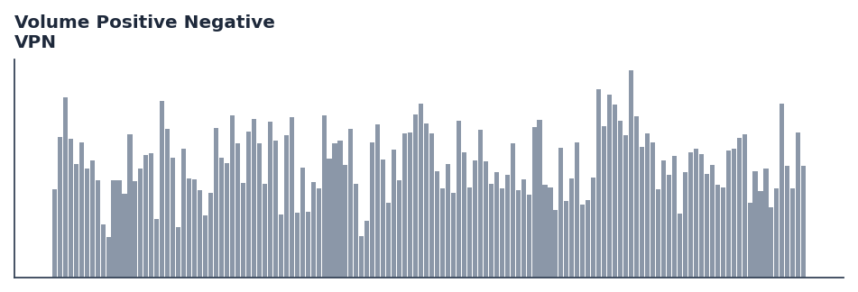

# Volume Positive Negative

<div class="indicator-meta"><span class="category-badge">Volume</span> <span class="kw-badge">volume</span> <span class="kw-badge">breakout</span> <span class="kw-badge">katsanos</span> <span class="kw-badge">vpn</span> <span class="kw-badge">momentum</span></div>

!!! warning "Uses the EMA-smoothed `Atr`, not Wilder's ATR"

    The VPN volume threshold is built on QuantWave's `Atr`, which smooths true range with an EMA
    (`alpha = 2/(period+1)`) rather than Wilder's RMA (`alpha = 1/period`, SMA-seeded)
    used by TA-Lib and TradingView Pine's `ta.atr`. Threshold crossings can differ from a Wilder-ATR VPN.

    No source has been recorded for the EMA smoothing — the `formula_source` recorded
    for this indicator describes the Wilder-based construction. See [Average True Range](average_true_range.md) for the full
    surface-by-surface breakdown, and `quantwave.conventions("vpn")` to read the
    divergence programmatically.

Detects high-volume breakouts by comparing volume on up days vs down days, normalized between -100 and 100.

## Visual Example



*Synthetic ideal per library logic. Generated 2026-07-01 IST via `docs/generate_all_previews.py` (reproducible; maps to core `Next<T>` implementation).*

## Description

Detects high-volume breakouts by comparing volume on up days vs down days, normalized between -100 and 100.

Use to confirm breakouts. A VPN value crossing above a critical threshold (e.g., 10) signals a high-volume positive breakout.

Volume-flow indicator for confirming price moves and detecting accumulation/distribution.

While originally using EMA for smoothing, this implementation employs the UltimateSmoother to further reduce lag in detecting volume-driven trend shifts, aligning with modern DSP standards for technical indicators.

**Typical applications:**

- Fade extremes in ranges; trade with trend on recoveries from oversold/overbought
- Use divergences as early warning — confirm with structure or volume
- Parameter default `30` — shorten for sensitivity, lengthen for stability
- Drop into `build_feature_matrix()` for ML research

QuantWave implements this via the universal `Next<T>` trait — bit-identical across Rust streaming, Python streaming, and Polars `.ta()` batch plugins.

## Formula / Specification

**Implementation** (`quantwave-core/src/indicators/vpn.rs`):

\[
TP = \frac{High + Low + Close}{3}
\]
\[
MF = TP - TP_{t-1}
\]
\[
MC = 0.1 \times ATR(Period)
\]
\[
VP = \sum_{i=0}^{Period-1} (\text{if } MF_{t-i} > MC_{t-i} \text{ then } Volume_{t-i} \text{ else } 0)
\]
\[
VN = \sum_{i=0}^{Period-1} (\text{if } MF_{t-i} < -MC_{t-i} \text{ then } Volume_{t-i} \text{ else } 0)
\]
\[
MAV = \text{Average}(Volume, Period)
\]
\[
VPN = \frac{VP - VN}{MAV \times Period} \times 100
\]

Gold-standard parity vectors: `quantwave-core/tests/gold_standard/vpn.json`.


## Parameters

| Parameter | Default | Description |
|-----------|---------|-------------|
| `period` | 30 | Calculation period for volume sums and ATR |
| `smooth_period` | 3 | Smoothing period for the final VPN value |


## Usage Examples

**Streaming (Rust)**

```rust
use quantwave_core::indicators::VPN;
use quantwave_core::traits::Next;

let mut ind = VPN::new(30);
for price in &prices {
    let value = ind.next(price);
}
```

**Streaming (Python)**

```python
from quantwave import VPN

ind = VPN(30)
for price in prices:
    value = ind.next(price)
```

**Polars Batch (Python)**

```python
import polars as pl
import quantwave as qw

def apply_volume_positive_negative(series: pl.Series) -> pl.Series:
    ind = qw.VPN(30)
    return pl.Series([ind.next(float(v)) for v in series.to_list()])

df = (
    pl.read_csv('ohlcv.csv')
    .lazy()
    .with_columns(
        pl.col("close").map_batches(apply_volume_positive_negative, return_dtype=pl.Float64).alias("volume_positive_negative")
    )
    .collect()
)
```

All surfaces are bit-identical via the single `Next<T>` implementation and proptests.

## Edge Cases & Limitations

- Warm-up: first `30` bars may return NaN or partial state per implementation.
- Parameter sensitivity: smaller periods increase noise; larger periods increase lag.
- Sudden gaps or bad ticks can distort rolling windows — consider pre-filtering.
- Single-series indicators ignore volume unless otherwise documented.
- Validated via proptests against gold-standard vectors where available.
- No look-ahead bias; streaming and Polars batch paths are bit-identical.

## Boundary Behavior

| Condition | Behavior |
|-----------|----------|
| Warm-up | Leading bars return NaN until warmup_bars is satisfied. |
| period > len | When period exceeds series length, output is all NaN. |
| NaN inputs | NaN in input propagates to output (NaN out). |
| Invalid params | Non-positive period or missing required params raise ValueError. |
| Empty data | Empty input returns an empty result series. |

## Related Indicators & See Also

- [Indicator Gallery](../gallery.md)
- [Native Indicators index](index.md)
- [Batch vs Streaming guide](../../../examples/batch-streaming.md)
- [RSI](relative_strength_index_rsi.md)
- [SuperTrend](../supertrend/)

## Sources & References

**Primary Source**: https://www.traders.com/Documentation/FEEDbk_docs/2021/04/TradersTips.html

**Implementation**: `quantwave-core/src/indicators/vpn.rs` (`VPN` / `VPN_METADATA`).
**Parity**: `quantwave-core/tests/gold_standard/vpn.json`

**Provenance**: Standards bulk upgrade 2026-07-01 IST — see `docs/DOCUMENTATION_STANDARDS.md`.
