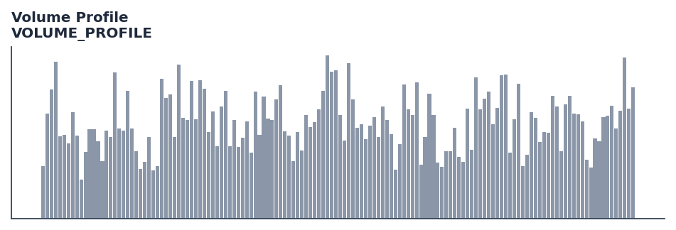

# Volume Profile

<div class="indicator-meta"><span class="category-badge">Volume</span> <span class="kw-badge">volume</span> <span class="kw-badge">profile</span> <span class="kw-badge">poc</span> <span class="kw-badge">support-resistance</span> <span class="kw-badge">auction-market-theory</span></div>

Calculates the price level with the highest traded volume (Point of Control) over a sliding window.

## Visual Example



*Synthetic ideal per library logic. Generated 2026-06-25 IST via `docs/generate_all_previews.py` (reproducible; maps to core `Next<T>` implementation).*

## Description

The Volume Profile indicator is a technical analysis tool that calculates the price level with the highest traded volume (point of control) over a sliding window.

This indicator is primarily used for identifying key market conditions. It provides a robust signal that can be easily integrated into both simple strategies and more complex machine learning feature pipelines. Compared to its alternatives, it offers a distinct balance of responsiveness and stability.

Traders often combine this with other metrics to confirm signals and avoid false positives during sideways market regimes. It remains a standard tool for systematic trading models.

Use to identify significant support and resistance levels. The POC represents the price where most market activity occurred, often acting as a magnet for price or a strong barrier. Essential for volume spread analysis and auction market theory.

Volume Profile is an advanced charting study that displays trading activity over a specified time period at specified price levels. The Point of Control (POC) is the single most important level in the profile, representing the price at which the most volume was traded. It serves as a key benchmark for identifying value areas and potential trend reversals.

QuantWave implements this indicator via the universal `Next<T>` trait, guaranteeing bit-identical results between Rust streaming, Python streaming, and Polars batch (`.ta()` / `map_batches`) surfaces.


## Formula / Specification

**Implementation** (`quantwave-core/src/indicators/volume_profile.rs`):

\[
BinIdx = \lfloor \frac{Price - Price_{min}}{BinSize} \rfloor
\]
\[
POC = Price_{min} + (Idx_{max\_vol} + 0.5) \times BinSize
\]

Gold-standard parity vectors: `quantwave-core/tests/gold_standard/volume_profile.json`.


## Parameters

| Parameter | Default | Description |
|-----------|---------|-------------|
| `period` | 200 | Sliding window size |
| `bins` | 50 | Number of price bins in the histogram |


## Usage Examples

**Streaming (Rust)**

```rust
use quantwave_core::indicators::VOLUME_PROFILE;
use quantwave_core::traits::Next;

let mut ind = VOLUME_PROFILE::new(200);
for price in &prices {
    let value = ind.next(price);
}
```

**Streaming (Python)**

```python
from quantwave import VOLUME_PROFILE

ind = VOLUME_PROFILE(200)
for price in prices:
    value = ind.next(price)
```

**Polars Batch (Python)**

```python
import polars as pl
import quantwave as qw

def apply_volume_profile(series: pl.Series) -> pl.Series:
    ind = qw.VOLUME_PROFILE(200)
    return pl.Series([ind.next(float(v)) for v in series.to_list()])

df = (
    pl.read_csv('ohlcv.csv')
    .lazy()
    .with_columns(
        pl.col("close").map_batches(apply_volume_profile, return_dtype=pl.Float64).alias("volume_profile")
    )
    .collect()
)
```

All surfaces are bit-identical via the single `Next<T>` implementation and proptests.

## Edge Cases & Limitations

- Warm-up: first `200` bars may return NaN or partial state per implementation.
- Parameter sensitivity: smaller periods increase noise; larger periods increase lag.
- Sudden gaps or bad ticks can distort rolling windows — consider pre-filtering.
- Single-series indicators ignore volume unless otherwise documented.
- Validated via proptests against gold-standard vectors where available.
- No look-ahead bias; streaming and Polars batch paths are bit-identical.

## Boundary Behavior

| Condition | Behavior |
|-----------|----------|
| Warm-up | Leading bars return NaN until warmup_bars is satisfied. |
| period > len | When period exceeds series length, output is all NaN. |
| NaN inputs | NaN in input propagates to output (NaN out). |
| Invalid params | Non-positive period or missing required params raise ValueError. |
| Empty data | Empty input returns an empty result series. |

## Related Indicators & See Also

- [Indicator Gallery](../gallery.md)
- [Native Indicators index](index.md)
- [Batch vs Streaming guide](../../../examples/batch-streaming.md)
- [RSI](relative_strength_index_rsi.md)
- [SuperTrend](supertrend.md)

## Sources & References

**Primary Source**: https://www.tradingview.com/support/solutions/43000502040-volume-profile-visible-range-vpvr/

**Implementation**: `quantwave-core/src/indicators/volume_profile.rs` (`VOLUME_PROFILE` / `VOLUME_PROFILE_METADATA`).
**Parity**: `quantwave-core/tests/gold_standard/volume_profile.json`

**Provenance**: Standards bulk upgrade 2026-06-25 IST — see `docs/DOCUMENTATION_STANDARDS.md`.
