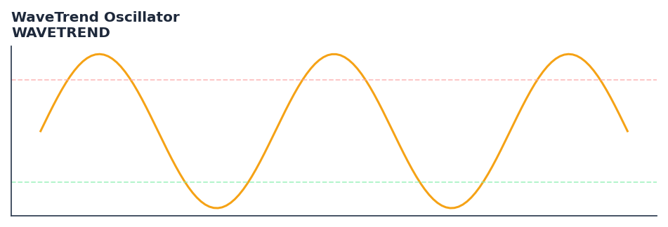

# WaveTrend Oscillator

<div class="indicator-meta"><span class="category-badge">Ehlers DSP</span> <span class="kw-badge">oscillator</span> <span class="kw-badge">momentum</span> <span class="kw-badge">overbought</span> <span class="kw-badge">oversold</span> <span class="kw-badge">ehlers</span></div>

WaveTrend is an oscillator that helps identify overbought and oversold conditions.

## Visual Example



*Synthetic ideal per library logic. Generated 2026-06-25 IST via `docs/generate_all_previews.py` (reproducible; maps to core `Next<T>` implementation).*

## Description

The WaveTrend Oscillator indicator is a technical analysis tool that wavetrend is an oscillator that helps identify overbought and oversold conditions.

This indicator is primarily used for identifying key market conditions. It provides a robust signal that can be easily integrated into both simple strategies and more complex machine learning feature pipelines. Compared to its alternatives, it offers a distinct balance of responsiveness and stability.

Traders often combine this with other metrics to confirm signals and avoid false positives during sideways market regimes. It remains a standard tool for systematic trading models.

Use as a momentum oscillator to identify overbought and oversold conditions. WaveTrend crossovers at extreme levels provide high-probability mean-reversion entry signals.

WaveTrend (popularized as LazyBear WaveTrend on TradingView) computes a channel index by normalizing price deviation from an EMA by the smoothed absolute deviation. A second EMA of this index produces the signal line. Extreme values (±60) with WT1-WT2 crossovers are the classic trade trigger.

QuantWave implements this indicator via the universal `Next<T>` trait, guaranteeing bit-identical results between Rust streaming, Python streaming, and Polars batch (`.ta()` / `map_batches`) surfaces.


## Formula / Specification

**Implementation** (`quantwave-core/src/indicators/wavetrend.rs`):

\[
WT_1 = EMA(ESA, n_2)
\]

Gold-standard parity vectors: `quantwave-core/tests/gold_standard/wavetrend.json`.


## Parameters

| Parameter | Default | Description |
|-----------|---------|-------------|
| `n1` | 10 | Channel Length |
| `n2` | 21 | Average Length |


## Usage Examples

**Streaming (Rust)**

```rust
use quantwave_core::indicators::WAVETREND;
use quantwave_core::traits::Next;

let mut ind = WAVETREND::new(10);
for price in &prices {
    let value = ind.next(price);
}
```

**Streaming (Python)**

```python
from quantwave import WAVETREND

ind = WAVETREND(10)
for price in prices:
    value = ind.next(price)
```

**Polars Batch (Python)**

```python
import polars as pl
import quantwave as qw

def apply_wavetrend_oscillator(series: pl.Series) -> pl.Series:
    ind = qw.WAVETREND(10)
    return pl.Series([ind.next(float(v)) for v in series.to_list()])

df = (
    pl.read_csv('ohlcv.csv')
    .lazy()
    .with_columns(
        pl.col("close").map_batches(apply_wavetrend_oscillator, return_dtype=pl.Float64).alias("wavetrend_oscillator")
    )
    .collect()
)
```

All surfaces are bit-identical via the single `Next<T>` implementation and proptests.

## Edge Cases & Limitations

- Recursive DSP filters require a warm-up period; first N bars may be unstable or raw-pass-through.
- Designed for cyclic/mean-reverting regimes; trending markets can produce lag or drift.
- Parameter `period` (or equivalent) controls cutoff — too small adds noise, too large adds lag.
- Prefer chaining with other Ehlers tools (Roofing Filter, SuperSmoother) on noisy inputs.
- Validated via proptests against gold-standard vectors where available.
- No look-ahead bias; suitable for live streaming and batch feature pipelines.

## Boundary Behavior

| Condition | Behavior |
|-----------|----------|
| Warm-up | Leading bars return NaN until warmup_bars is satisfied. |
| period > len | When period exceeds series length, output is all NaN. |
| NaN inputs | NaN in input propagates to output (NaN out). |
| Invalid params | Non-positive period or missing required params raise ValueError. |
| Empty data | Empty input returns an empty result series. |

## Related Indicators & See Also

- [Indicator Gallery](../gallery.md)
- [Native Indicators index](index.md)
- [Ehlers DSP guide](../ehlers/index.md)
- [Cyber Cycle](cyber_cycle.md)
- [SuperSmoother](supersmoother.md)

## Sources & References

**Primary Source**: https://www.tradingview.com/script/2KE8wTuF-Indicator-WaveTrend-Oscillator-WT/

**Implementation**: `quantwave-core/src/indicators/wavetrend.rs` (`WAVETREND` / `WAVETREND_METADATA`).
**Parity**: `quantwave-core/tests/gold_standard/wavetrend.json`

**Provenance**: Standards bulk upgrade 2026-06-25 IST — see `docs/DOCUMENTATION_STANDARDS.md`.
