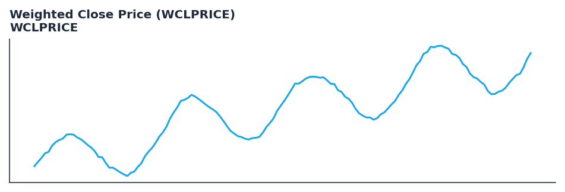

# Weighted Close Price (WCLPRICE)

<div class="indicator-meta"><span class="category-badge">Classic</span> <span class="kw-badge">price-transform</span> <span class="kw-badge">classic</span> <span class="kw-badge">weighted</span></div>

An average of the High, Low, and Close prices, with double weight given to the Close price.

## Visual Example



*Synthetic ideal per library logic. Generated 2026-06-25 IST via `docs/generate_all_previews.py` (reproducible; maps to core `Next<T>` implementation).*

## Description

The Weighted Close Price (WCLPRICE) indicator is a technical analysis tool that an average of the high, low, and close prices, with double weight given to the close price.

This indicator is primarily used for identifying key market conditions. It provides a robust signal that can be easily integrated into both simple strategies and more complex machine learning feature pipelines. Compared to its alternatives, it offers a distinct balance of responsiveness and stability.

Traders often combine this with other metrics to confirm signals and avoid false positives during sideways market regimes. It remains a standard tool for systematic trading models.

Use to emphasize the importance of the closing price while still accounting for the total range of the bar.

Weighted Close Price gives additional significance to the Close, reflecting the widely held belief that the closing price is the most important data point in a trading session. It provides a more nuanced input for smoothing algorithms. — TA-Lib Documentation

QuantWave implements this indicator via the universal `Next<T>` trait, guaranteeing bit-identical results between Rust streaming, Python streaming, and Polars batch (`.ta()` / `map_batches`) surfaces.


## Formula / Specification

**Implementation** (`quantwave-core/src/indicators/price_transform.rs`):

\[
WCLPRICE = \frac{High + Low + 2 \times Close}{4}
\]

Gold-standard parity vectors: `quantwave-core/tests/gold_standard/wclprice.json`.


## Parameters

| Parameter | Default | Description |
|-----------|---------|-------------|
| (none) | — | No tunable parameters for this detector. |

## Usage Examples

**Streaming (Rust)**

```rust
use quantwave_core::indicators::WCLPRICE;
use quantwave_core::traits::Next;

let mut ind = WCLPRICE::new(14);
for price in &prices {
    let value = ind.next(price);
}
```

**Streaming (Python)**

```python
from quantwave import WCLPRICE

ind = WCLPRICE(14)
for price in prices:
    value = ind.next(price)
```

**Polars Batch (Python)**

```python
import polars as pl
import quantwave as qw

def apply_weighted_close_price_wclprice(series: pl.Series) -> pl.Series:
    ind = qw.WCLPRICE(14)
    return pl.Series([ind.next(float(v)) for v in series.to_list()])

df = (
    pl.read_csv('ohlcv.csv')
    .lazy()
    .with_columns(
        pl.col("close").map_batches(apply_weighted_close_price_wclprice, return_dtype=pl.Float64).alias("weighted_close_price_wclprice")
    )
    .collect()
)
```

All surfaces are bit-identical via the single `Next<T>` implementation and proptests.

## Edge Cases & Limitations

- Warm-up: first `N` bars may return NaN or partial state per implementation.
- Parameter sensitivity: smaller periods increase noise; larger periods increase lag.
- Sudden gaps or bad ticks can distort rolling windows — consider pre-filtering.
- Single-series indicators ignore volume unless otherwise documented.
- Validated via proptests against gold-standard vectors where available.
- No look-ahead bias; streaming and Polars batch paths are bit-identical.

## Boundary Behavior

| Condition | Behavior |
|-----------|----------|
| Warm-up | Leading bars return NaN until warmup_bars is satisfied. |
| period > len | When period exceeds series length, output is all NaN. |
| NaN inputs | NaN in input propagates to output (NaN out). |
| Invalid params | Non-positive period or missing required params raise ValueError. |
| Empty data | Empty input returns an empty result series. |

## Related Indicators & See Also

- [Indicator Gallery](../gallery.md)
- [Native Indicators index](index.md)
- [Batch vs Streaming guide](../../../examples/batch-streaming.md)
- [RSI](relative_strength_index_rsi.md)
- [SuperTrend](supertrend.md)

## Sources & References

**Primary Source**: https://www.tradingview.com/support/solutions/43000502590-weighted-close-wclprice/

**Implementation**: `quantwave-core/src/indicators/price_transform.rs` (`WCLPRICE` / `WCLPRICE_METADATA`).
**Parity**: `quantwave-core/tests/gold_standard/wclprice.json`

**Provenance**: Standards bulk upgrade 2026-06-25 IST — see `docs/DOCUMENTATION_STANDARDS.md`.
