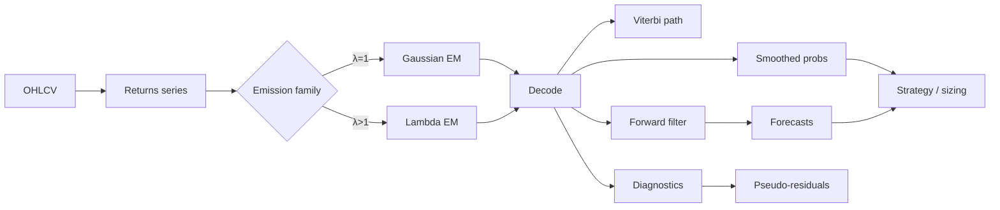

# ldhmm-Style HMM Workflow

Research-grade regime detection with **fittable** Hidden Markov Models — parity with the [ldhmm](https://cran.r-project.org/package=ldhmm) R package (Lihn, [SSRN 2979516](https://papers.ssrn.com/sol3/papers.cfm?abstract_id=2979516)).

Use this guide when you need to **estimate** transition dynamics and emission parameters from data, decode latent states with forward–backward smoothing, and forecast mixture volatility — not when a fixed Hamilton bull/bear preset is enough.

**Related:** [Regime Detection overview](index.md) · [gaussian_hmm](../native/gaussian_hmm.md) · [lambda_hmm](../native/lambda_hmm.md) · [hmm_forecast](../native/hmm_forecast.md)

---

## When to use ldhmm vs preset HMM

| Need | Use |
|------|-----|
| Quick bull/bear labels, zero config | `.ta().hmm_bull_bear(col)` or `qw.BullBearHMM` |
| Fit Γ, δ, (μ, σ, λ) on your return series | **This guide** — `fit_gaussian_hmm` / `.hmm_fit` |
| Leptokurtic / fat-tailed returns | `fit_lambdas=True` (lambda / ecld emissions) |
| Vol forecast + model checking | `.hmm_forecast_vol`, pseudo-residuals, decode stats |
| Live causal regime probs | `GaussianHmmFilterPy` streaming filter |

---

## End-to-end workflow



**Batch research path:** fit once → decode → diagnostics → join labels to signals.  
**Live path:** fit offline (or rolling refit) → deploy `GaussianHmmFilterPy` with frozen params.

---

## 1. Prepare observations

ldhmm fits on a **univariate** series — typically daily log-returns or simple returns.

```python
import polars as pl

df = pl.read_parquet("ohlcv.parquet").with_columns(
    pl.col("close").pct_change().alias("returns"),
    # or: (pl.col("close").log() - pl.col("close").log().shift(1)).alias("log_returns"),
)
returns = df["returns"].drop_nulls().to_list()
```

| Practice | Rationale |
|----------|-----------|
| ≥ 100 finite bars | EM unstable on very short samples |
| Drop NaN / inf before fit | Non-finite obs are skipped; gaps get uniform fallback in Polars batch |
| Same bar index for joins | Decode outputs align 1:1 with input rows (after null handling) |

---

## 2. Choose emission family

| Mode | `fit_lambdas` | Emission | When |
|------|---------------|----------|------|
| **Gaussian** | `False` | Normal per state (λ=1) | Baseline; matches ldhmm at λ=1 |
| **Lambda (ecld)** | `True` | Symmetric exponential-power; β=2/λ | Excess kurtosis, crash-heavy tails |

Lambda mode nests Gaussian: λ=1 reduces to normal. Per-state λ is estimated in the M-step when `fit_lambdas=True`.

---

## 3. Fit parameters (Python)

Preferred when you fit **once** and reuse params (Polars batch methods refit EM per call).

```python
import quantwave as qw

fit = qw.fit_gaussian_hmm(
    returns,
    n_states=2,
    max_iter=100,
    fit_lambdas=True,  # lambda / ldhmm mode
)

print(f"MLLK={fit.log_likelihood:.2f}  AIC={fit.aic:.2f}  BIC={fit.bic:.2f}")
print(f"iterations={fit.iterations}")
print(f"means={fit.params.means}")
print(f"stds={fit.params.stds}")
print(f"lambdas={fit.params.lambdas}")  # per-state λ when fit_lambdas=True
print(f"gamma={fit.params.gamma_flat}")  # row-major Γ
```

**Model selection:** compare `aic` / `bic` across `n_states` (2 vs 3) and emission family. Lower is better; BIC penalizes complexity more.

**Outputs:**

| Field | Meaning |
|-------|---------|
| `params` | Fitted δ, Γ, μ, σ, λ |
| `viterbi_path` | Global most-likely state index per bar (0-based) |
| `smooth_probs_flat` | Forward–backward smoothed P(state \| all data), state-major layout |
| `log_likelihood` | MLLK at convergence |

Gold-standard parity: `quantwave-core/tests/gold_standard/hmm_gaussian_2state.json`, `hmm_lambda_2state.json`.

---

## 4. Decode in Polars (batch)

Convenient for DataFrame-native research; chains with `.ta()` like other indicators.

```python
import polars as pl
import quantwave  # registers pl.col().ta

out = (
    df.lazy()
    .ta()
    .hmm_fit("returns", n_states=2, max_iter=100, fit_lambdas=True)
    .collect()
)

# Struct column hmm_fit_data:
#   hmm_fit_state          — Viterbi index (UInt32)
#   hmm_fit_smooth_probs   — List[Float64] length n_states per row
```

**Note:** `.hmm_fit`, `.hmm_forecast_vol`, `.hmm_pseudo_residuals`, and `.hmm_decode_stats` each run a full EM fit on the column. For production pipelines, fit in Python once and apply params via the streaming filter or custom joins.

---

## 5. Live streaming filter

Causal **forward filter** — P(state \| data so far) — with batch parity via `Next<f64>`.

```python
import quantwave as qw

fit = qw.fit_gaussian_hmm(returns, n_states=2, max_iter=100, fit_lambdas=False)
filt = qw.GaussianHmmFilterPy.from_params(fit.params)

for r in live_returns:
    probs = filt.next(r)  # sums to 1.0
    dominant = probs.index(max(probs))
```

Use smoothed probs for **historical** labeling (no lookahead); use the filter for **real-time** regime weights.

---

## 6. Diagnostics (model checking)

Aligned with ldhmm `pseudo_residuals` and `decode_stats_history`.

### Python (full bundle)

```python
diag = qw.gaussian_hmm_diagnostics(fit.params, returns)

# Pseudo-residuals: PIT transform; ~N(0,1) if model is well specified
print(diag.pseudo_residuals[-5:])

# Per-bar weighted emission stats (smoothed-prob mixture)
print(diag.decode_weighted_means[-1], diag.decode_weighted_vols[-1])

# Point forecast from terminal filter state
print(diag.forecast_state_h1, diag.forecast_vol_h1, diag.forecast_mean_h1)
```

### Polars (per-column batch)

```python
out = (
    df.lazy()
    .ta()
    .hmm_pseudo_residuals("returns", n_states=2, max_iter=100, fit_lambdas=True)
    .hmm_decode_stats("returns", n_states=2, max_iter=100, fit_lambdas=True)
    .collect()
)
# hmm_pseudo_residual
# hmm_decode_stats_data: hmm_decode_weighted_mean, hmm_decode_weighted_vol, hmm_decode_weighted_lambda
```

**Interpretation:** heavy tails in pseudo-residual QQ-plots suggest lambda mode or more states; systematic bias suggests mis-specified μ/σ per regime.

---

## 7. Volatility & state forecasts

Mixture forecasts use π\_{t+h|t} = π_t · Γ^h and lambda-aware emission variances.

### Python

```python
# After diagnostics, or from last filter probs:
last_probs = [0.52, 0.48]  # example
state_h1 = qw.gaussian_hmm_forecast_state(fit.params, last_probs, horizon=1)
vol_h1 = qw.gaussian_hmm_forecast_vol(fit.params, last_probs, horizon=1)
```

### Polars (h-step vol from each bar's filter)

```python
out = (
    df.lazy()
    .ta()
    .hmm_forecast_vol(
        "returns", n_states=2, max_iter=100, fit_lambdas=True, horizon=5
    )
    .collect()
)
# Column: hmm_forecast_vol
```

Use mixture vol for position sizing, VaR scaling, or options vol regime overlays.

---

## 8. Strategy integration

### Regime filter (long only in low-vol / bull-like state)

```python
out = out.with_columns(
    pl.col("hmm_fit_data").struct.field("hmm_fit_state").alias("regime"),
).with_columns(
    (pl.col("regime") == 0).cast(pl.Float64).alias("allow_long"),
)
```

Map state indices to economic labels **after** inspecting fitted `means` / `stds` — state 0 is not guaranteed to be "bull".

### Vol targeting

```python
target_risk = 0.10  # annualized example
out = out.with_columns(
    (target_risk / pl.col("hmm_forecast_vol").clip(1e-6, None)).alias("vol_scalar"),
)
```

### ML feature matrix

Regime HMM labels are included in the recommended preset via `regime_hmm` in `build_feature_matrix()`. For fitted ldhmm labels, join `hmm_fit_state` or smoothed probs as extra columns before training.

See [ML Features guide](../../ml_features.md) and the [ML → backtest notebook](../../../examples/notebooks/ml_feature_backtest_parity.md).

---

## ldhmm R ↔ QuantWave mapping

| ldhmm / paper concept | QuantWave (Python) | QuantWave (Polars) |
|----------------------|--------------------|--------------------|
| EM fit | `fit_gaussian_hmm` | `.hmm_fit(...)` |
| Viterbi + smooth probs | `fit.viterbi_path`, `smooth_probs_flat` | `hmm_fit_data` struct |
| Forward filter | `GaussianHmmFilterPy.next` | (use Python filter) |
| `pseudo_residuals` | `gaussian_hmm_diagnostics` | `.hmm_pseudo_residuals` |
| `decode_stats_history` | `diag.decode_weighted_*` | `.hmm_decode_stats` |
| `forecast_volatility` | `gaussian_hmm_forecast_vol` | `.hmm_forecast_vol` |
| `forecast_state` | `gaussian_hmm_forecast_state` | via diagnostics `forecast_state_h1` |
| Lambda emissions | `fit_lambdas=True` | `fit_lambdas=True` |

**Not yet implemented:** composite recession HMM (SSRN 3435667) — multi-component macro regimes. Track as a separate epic if needed.

---

## Parity & tests

```bash
cargo nextest run -p quantwave-core -- regimes
python -m pytest quantwave-python/tests/test_gaussian_hmm.py quantwave-python/tests/test_hmm_forecast.py -q
```

Streaming vs batch: `GaussianHmmFilter` implements `Next<f64>`; proptests assert filter probs match forward-filter column from batch decode.

---

## Edge cases

| Condition | Behavior |
|-----------|----------|
| `len(obs) ≤ n_states` | Polars: uniform probs, state 0; Python fit may fail |
| Non-finite returns | Skipped in fit; Polars fills uniform at those indices |
| `max_iter` too low | MLLK may not converge — watch `iterations` and AIC stability |
| Refit every bar in Polars chain | Each `.hmm_*` call refits — prefer Python fit-once for latency |

---

## Related docs

- [Regime Detection overview](index.md) — vol clustering, GMM, PELT, preset HMM
- [gaussian_hmm](../native/gaussian_hmm.md) — API reference
- [lambda_hmm](../native/lambda_hmm.md) — ecld emissions
- [hmm_forecast](../native/hmm_forecast.md) — forecast formulas
- [ML Features](../../ml_features.md) — feature matrix + regime joins

**Sources:** `references/ldhmm/ssrn-2979516.pdf`, `references/ldhmm/ldhmm-cran-reference.pdf`; Hamilton (1989); Zucchini et al. (2016).